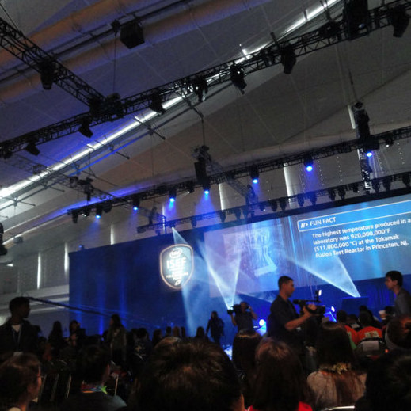
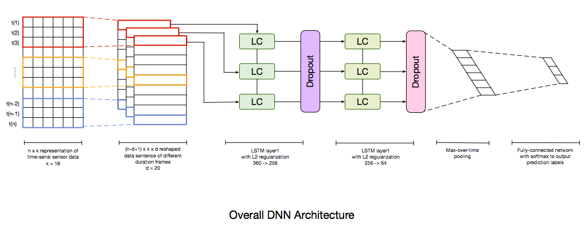
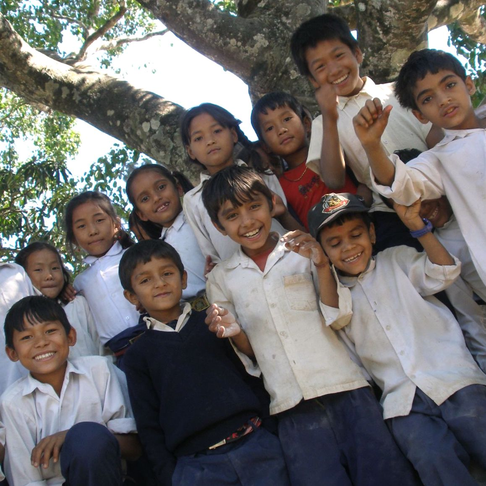

 
I'm **Hang**.

 

Currently, I live in Shanghai, China. I'm expected in July, 2017 with a B.E. Degree of Information Security (IS) from Shanghai Jiao Tong University.

Now, please allow me to introduce myself as a *learner*, a *developer* and an *observer.*

## Learner
If being good at coursework counts, I should be one of those so-called "skilled learner". Till the senior year, my major GPA is `3.85/4.0`. I have never failed to rank top 3 in [my institution](http://infosec.sjtu.edu.cn/English.asp) out of 83 peers during the whole college phase. Yet I guess there should be more than that.

 

I start to learn programming from the junior high. At that time, I and my other two teammates participated in [*ISEF'12*](https://student.societyforscience.org/intel-isef) (the world’s largest international pre-college science competition) as a part of Chinese Delegation. We made our first project to estimate the submergence tolerant factors in rice genes and won a silver medal which was one of the best awards of China.

Through all these years, I have proceeded with a stable pace, from the curious high school kid to an independent researcher. I published three Engineer Indexed papers and submitted one onto the top proceeding, [*INFOCOM'17*](http://infocom2017.ieee-infocom.org/). Please check [here]({{ site.url }}/publications) for more details.

Habitually, I here kept a [learning plan]({{ site.url }}/plans) of topics for next six coming months.

## Developer
This is the identity I've carried along for the most of time.

Equipped with a strong technique background, I push the development of *pragmatic* usage in OS kernels, servers, webpages, mobile apps, scientific computations, and etc. Consequently, I spent this summer in 2016 in [HCII@CMU](https://www.hcii.cmu.edu/) as an Research Intern.

<em>a demo of my intern product's deep learning network architecture</em>
 

My current interest is located at the intersection of *Ubiquitous Computing & Artificial Intelligence*, basically about automation in self-driving car. Given my experiences extensively involved in this topic, I guess it might be the perfect match.

For the project on hands, tremendously *distributed* database have also captured me, given its promising future regarding to the Informatics Industry. An apology for not publishing this, given that it's a rather private co-work between our lab and [Google Shanghai](https://www.google.com/intl/sr/about/careers/locations/shanghai/).

A selective list of projects that I have worked on could be found in [Portfolio]({{ site.url }}/portfolio).

## Observer
Yep, a clumsy one.

I intend to record tiny fragments of life, by photos and my own involvements.

 

In 2013, I spent two months as a volunteer in Nepal, teaching local kids about Chinese and English. It was actually a life-time experience escaping from the metropolis and blend in with a culture way different from yours.

More pieces of my photography (if it counts) could be found in [Gallery]({{ site.url }}/gallery). :yum:
